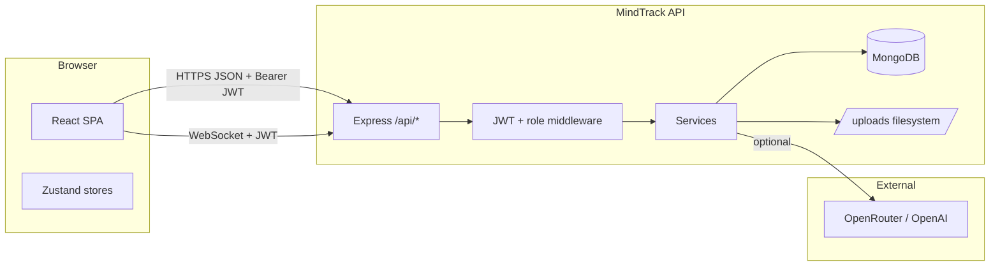

# MindTrack

**MindTrack** is a full-stack mental health care web application. It connects **clients** with **verified psychiatrists (professionals)**, supports **daily mood surveys (DMS)**, **goals/tasks**, **medications**, **clinical-style reports**, **secure chat**, **appointments with payment receipt workflows**, and **admin/HR/employee** tooling for verification and operations.

---

## Table of contents

1. [Tech stack](#tech-stack)
2. [High-level architecture](#high-level-architecture)
3. [Repository layout](#repository-layout)
4. [Prerequisites](#prerequisites)
5. [Environment variables](#environment-variables)
6. [Running locally](#running-locally)
7. [Database](#database)
8. [Backend (Express)](#backend-express)
9. [HTTP API reference](#http-api-reference)
10. [Real-time (Socket.IO)](#real-time-socketio)
11. [File uploads](#file-uploads)
12. [AI recommendations & quotes](#ai-recommendations--quotes)
13. [Frontend (Vite + React)](#frontend-vite--react)
14. [Role-based features](#role-based-features)
15. [Security & auth notes](#security--auth-notes)
16. [Scripts & tooling](#scripts--tooling)
17. [Limitations & UI stubs](#limitations--ui-stubs)

---

## Tech stack

| Layer | Technology |
|--------|------------|
| **Client UI** | React 19, React Router 7, Vite 8, Tailwind CSS 4, Zustand, Lucide icons, `@react-pdf/renderer` (report PDFs) |
| **Client HTTP** | `fetch` via `client/src/lib/http.js` (JSON + multipart helpers) |
| **Client real-time** | `socket.io-client` |
| **Server** | Node.js, **Express 5**, Mongoose 9, **MongoDB** |
| **Server real-time** | `socket.io` (HTTP upgrade on same process as Express) |
| **Auth** | JWT (`jsonwebtoken`), bcrypt password hashing, TOTP 2FA (`otplib` + `qrcode`) |
| **Uploads** | `multer` (chat attachments, appointment payment receipts) |
| **Security headers** | `helmet`, `cors`, `morgan` logging |
| **AI (optional)** | OpenAI Chat Completions and/or OpenRouter; server-side `fetch`, JSON-mode with fallbacks |

---

## High-level architecture



- **Base URL (dev):** API `http://localhost:5000/api`, static uploads `http://localhost:5000/uploads/...`, client `http://localhost:5173`.
- **API responses:** Most endpoints return `{ success: true, data }` or `{ success: false, message, ... }` on error (see `errorMiddleware`).

---

## Repository layout

```
Mindtrack/
├── client/                 # Vite React SPA
│   └── src/
│       ├── api/            # Thin wrappers: authApi, clientApi, userApi, professionalApi, chatApi, reportApi, adminApi
│       ├── components/     # ProtectedRoute, ProfessionalVerifiedRoute, TwoFactorSection, etc.
│       ├── lib/            # http.js, socket.js, query helpers
│       ├── pages/          # Route-level UI by persona (client, psychiatrist, admin, hr, employee, onboarding, auth)
│       ├── reports/        # PDF document (e.g. ClientReportDocument.jsx)
│       └── store/          # authStore.js, appStore.js
├── server/
│   ├── src/
│   │   ├── app.js          # Express app: middleware, /api mount, static /uploads
│   │   ├── server.js       # HTTP server, Socket.IO, listen + error handler
│   │   ├── config/       # db.js
│   │   ├── controllers/    # Thin: parse req → call service → JSON
│   │   ├── middlewares/    # auth, roles, validation, multer, errors
│   │   ├── models/         # Mongoose schemas
│   │   ├── routes/         # auth, users, professionals, admin, reports, chat
│   │   ├── services/       # Business logic (largest surface area)
│   │   └── utils/          # ApiError, asyncHandler, constants
│   ├── scripts/            # seedUsers.js, etc.
│   ├── uploads/            # Runtime chat + appointment files (not always in git)
│   └── nodemon.json        # Dev: watch src/, delay restarts
└── README.md               # This file
```

---

## Prerequisites

- **Node.js** (v18+ recommended; project tested on newer LTS/current).
- **MongoDB** reachable via `MONGO_URI` (local or Atlas).
- Optional: **OpenRouter** and/or **OpenAI** API keys for live AI features.

---

## Environment variables

Copy `server/.env.example` to `server/.env` and configure.

| Variable | Purpose |
|----------|---------|
| `PORT` | API port (default `5000`) |
| `MONGO_URI` | MongoDB connection string |
| `JWT_SECRET` | Secret for signing access tokens |
| `JWT_EXPIRES_IN` | Token lifetime (e.g. `7d`) |
| `CLIENT_ORIGIN` | CORS origin (e.g. `http://localhost:5173`) |
| `OPENROUTER_API_KEY` | Optional; AI via OpenRouter |
| `OPENROUTER_MODEL` | Primary OpenRouter model slug |
| `OPENROUTER_MODEL_FALLBACKS` | Comma-separated fallback slugs |
| `OPENROUTER_QUOTE_MODEL` | Optional separate model for dashboard quotes |
| `OPENROUTER_SITE_URL` | `HTTP-Referer` header for OpenRouter |
| `OPENROUTER_APP_NAME` | `X-Title` header for OpenRouter |
| `OPENAI_API_KEY` | Optional; AI via OpenAI directly |
| `OPENAI_MODEL` / `OPENAI_QUOTE_MODEL` | Override default OpenAI models |

**Note:** Without AI keys, quote and goal/task recommendations use **built-in fallback** content (still functional).

---

## Running locally

1. **MongoDB** running and `MONGO_URI` set.
2. **Server:**  
   `cd server && npm install && npm run dev`  
   Uses **nodemon** with `nodemon.json` (watches `server/src`, delay to reduce port races).
3. **Client:**  
   `cd client && npm install && npm run dev`  
   Vite dev server (default **5173**).
4. Optional **seed users:**  
   `cd server && npm run seed:users`  
   See [Seed data](#seed-data).

If port **5000** is busy (`EADDRINUSE`), stop the other process or set `PORT` to another value in `.env`.

---

## Database

**Engine:** MongoDB via **Mongoose**.

### Collections (models → typical collection names)

| Model file | Collection | Summary |
|------------|------------|---------|
| `User.js` | `users` | Auth identity: email, password hash, role, 2FA flags, terms |
| `UserProfile.js` | `userprofiles` | Client profile, preferences (`quoteType`, theme), medical hints |
| `UserRole.js` | `userroles` | Auxiliary role mapping if used |
| `Goal.js` | `goals` | Client goals (long-term / horizons) |
| `Task.js` | `tasks` | Client tasks, completion, optional link to goal |
| `MoodSurvey.js` | `moodsurveys` | DMS: mood/anxiety/stress scores, notes, `extraFields` |
| `MedicationLog.js` | `medicationlogs` | Medication adherence / logs |
| `Appointment.js` | `appointments` | Client–professional sessions: status, payment ref, receipt URL, verification notes |
| `ExternalAppointment.js` | `externalappointments` | Professional’s external/off-calendar entries |
| `ProfessionalProfile.js` | `professionalprofiles` | Public-ish profile: fee, bio, rating |
| `ProfessionalVerification.js` | `professionalverifications` | Degree, CV URL, HR/admin verification workflow |
| `Review.js` | `reviews` | Client ratings/comments for professionals |
| `ChatSession.js` | `chatsessions` | Client ↔ professional chat thread |
| `ChatMessage.js` | `chatmessages` | Messages; TEXT or FILE with attachment URLs |
| `Notification.js` | `notifications` | In-app notifications + optional `linkPath` |
| `Complaint.js` | `complaints` | Abuse/support complaints between users |
| `ReportSnapshot.js` | `reportsnapshots` | Admin report snapshots |
| `AuditLog.js` | `auditlogs` | Admin audit trail |

### Roles (`server/src/utils/constants.js`)

- `CLIENT`, `PROFESSIONAL`, `EMPLOYEE`, `HR`, `ADMIN`

---

## Backend (Express)

### Request lifecycle

1. **Global:** `helmet`, `cors`, `express.json`, `morgan`, static `/uploads`.
2. **Routes:** Mounted at `/api` (`server/src/routes/index.js`).
3. **Protected routes:** `protect` loads user from JWT (`middlewares/authMiddleware.js`).
4. **Role gates:** `authorize(...roles)` (`middlewares/roleMiddleware.js`).
5. **Controllers:** `asyncHandler` wraps async actions; call **services**; return `{ success, data }`.
6. **Errors:** `ApiError` + centralized `errorMiddleware`.

### Main services (`server/src/services/`)

| Service | Responsibility |
|---------|------------------|
| `authService.js` | Signup/login, JWT issue, 2FA setup/verify/disable, terms |
| `userService.js` | Profile, goals, tasks, moods, meds, complaints; DMS once-per-day rules; onboarding merge |
| `professionalService.js` | Profiles, verification submit, appointments (create/cancel/status), client care (goals/tasks **without** pros marking task “done”), chat lock, reviews, external appointments |
| `notificationService.js` | Create/list/read notifications; Socket.IO fan-out |
| `reportService.js` | Daily/weekly/monthly/yearly client reports; medication impact; platform report; PDF-oriented aggregates |
| `recommendationService.js` | AI + fallback: goal/task JSON, dashboard quote JSON |
| `adminService.js` | Verifications, unified requests, users, tickets, audit logs, complaints resolution, employee creation |
| `chatService.js` (if present) / inline in controller | Sessions and messages |

*(Exact file names may vary; grep `require("../services/` in controllers for the full list.)*

---

## HTTP API reference

All paths below are prefixed with **`/api`**.

### Auth — `/api/auth`

| Method | Path | Auth | Description |
|--------|------|------|-------------|
| POST | `/signup` | No | Register (`name`, `email`, `password`, optional `role`, `phone`) |
| POST | `/login` | No | Login; may return temp token for 2FA |
| POST | `/login/2fa` | No | Complete login with `tempToken` + TOTP `code` |
| POST | `/2fa/setup/start` | JWT | Begin TOTP enrollment |
| POST | `/2fa/setup/verify` | JWT | Confirm TOTP with `code` |
| POST | `/2fa/disable` | JWT | Disable 2FA (`password`, `code`) |
| POST | `/terms/accept` | JWT | Accept terms of service |

### Users — `/api/users` *(router-level `protect` on all routes)*

| Method | Path | Role / notes | Description |
|--------|------|----------------|-------------|
| GET | `/me` | Any authenticated | Current user + profile payload |
| PATCH | `/me/profile` | Any | Update merged profile / preferences |
| GET | `/me/notifications` | Any | List notifications (`?limit`) |
| GET | `/me/notifications/unread-count` | Any | Unread count |
| POST | `/me/notifications/read-all` | Any | Mark all read |
| PATCH | `/me/notifications/:id/read` | Any | Mark one read |
| POST | `/goals` | CLIENT | Create goal |
| GET | `/goals` | CLIENT | List goals |
| PATCH | `/goals/:id` | CLIENT | Update goal |
| POST | `/recommendations/goals-tasks` | CLIENT | AI-assisted suggestions from user context |
| GET | `/recommendations/quote` | CLIENT | AI daily quote + tip (uses profile `quoteType`) |
| POST | `/tasks` | CLIENT | Create task |
| GET | `/tasks` | CLIENT | List tasks |
| PATCH | `/tasks/:id` | CLIENT | Update task |
| POST | `/mood-surveys` | Authenticated | Submit DMS |
| GET | `/mood-surveys` | Authenticated | List surveys |
| POST | `/medications/logs` | Authenticated | Log medication |
| GET | `/medications/logs` | Authenticated | List logs |
| POST | `/complaints` | Authenticated | File complaint against another user |
| GET | `/complaints` | Authenticated | List own complaints |

### Professionals — `/api/professionals`

Public / mixed:

| Method | Path | Auth | Description |
|--------|------|------|-------------|
| GET | `/search` | No | List **approved** verified professionals for directory |
| GET | `/profile/:id` | No | Professional profile by id |
| GET | `/:professionalUserId/reviews` | No | Reviews for that professional |
| POST | `/:professionalUserId/reviews` | CLIENT | Submit review |

Appointments & booking:

| Method | Path | Auth | Description |
|--------|------|------|-------------|
| POST | `/appointments/upload-receipt` | CLIENT | Multipart `file` + `professionalUserId`; requires prior intro chat session |
| POST | `/appointments` | JWT | Client books professional **or** professional books client (different body fields) |
| GET | `/appointments` | JWT | List appointments for current user (client or professional) |
| PATCH | `/appointments/:id/cancel` | CLIENT | Cancel own appointment |
| PATCH | `/appointments/:id/status` | PROFESSIONAL | Confirm/cancel pending booking; body includes `paymentVerificationNotes` when deciding |

Care panel (professional):

| Method | Path | Role | Description |
|--------|------|------|-------------|
| GET | `/me/clients` | PROFESSIONAL | Clients with **CONFIRMED** appointments |
| GET | `/clients/:clientUserId/goals-tasks` | PROFESSIONAL | Goals + tasks for approved client |
| POST | `/clients/:clientUserId/goals` | PROFESSIONAL | Create goal for client |
| PATCH | `/clients/:clientUserId/goals/:goalId` | PROFESSIONAL | Update goal |
| POST | `/clients/:clientUserId/tasks` | PROFESSIONAL | Create task |
| PATCH | `/clients/:clientUserId/tasks/:taskId` | PROFESSIONAL | Update task (completion not delegated to pro per product rules) |
| POST | `/clients/:clientUserId/recommendations/goals-tasks` | PROFESSIONAL | AI suggestions for that client |
| GET | `/requests` | PROFESSIONAL | Pending appointment requests |
| POST | `/me/profile` | PROFESSIONAL | Upsert professional profile |
| GET | `/me/profile` | PROFESSIONAL | Get own profile |
| POST | `/me/verification` | PROFESSIONAL | Submit verification docs metadata |
| GET | `/me/verification-status` | PROFESSIONAL | Latest verification record |
| PATCH | `/chat-sessions/:id/lock` | PROFESSIONAL | Lock/unlock chat session |
| GET | `/external-appointments` | PROFESSIONAL | List external appointments |
| POST | `/external-appointments` | PROFESSIONAL | Create external appointment |
| PATCH | `/external-appointments/:id/status` | PROFESSIONAL | Update status |

### Admin — `/api/admin` *(all `protect`; role checks per route)*

HR + Admin unless noted:

| Method | Path | Roles | Description |
|--------|------|-------|-------------|
| GET | `/dashboard/stats` | HR, ADMIN | Dashboard aggregates |
| GET | `/verifications` | EMPLOYEE, HR, ADMIN | List professional verifications |
| GET | `/verifications/:id` | EMPLOYEE, HR, ADMIN | Detail |
| POST | `/verifications/:id/approve` | EMPLOYEE, HR, ADMIN | Approve |
| POST | `/verifications/:id/reject` | EMPLOYEE, HR, ADMIN | Reject (`reviewNotes`) |
| GET | `/requests` | HR, ADMIN | Unified queue (verifications + appointments) |
| PATCH | `/requests/appointments/:id/status` | HR, ADMIN | Update appointment request |
| GET | `/employees`, `/hr-users`, `/clients`, `/psychiatrists`, `/users` | HR, ADMIN | Directory listings with query filters |
| GET | `/clients/:id`, `/psychiatrists/:id`, `/users/:id` | HR, ADMIN | Detail views |
| GET | `/complaints`, `/complaints/:id` | HR, ADMIN | Complaints queue |
| POST | `/complaints/:id/resolve` | HR, ADMIN | Resolve with notes |
| GET | `/complaints/:id/evidence` | HR, ADMIN | Evidence URL / payload |
| PATCH | `/users/:id/role` | **ADMIN only** | Change role |
| PATCH | `/users/:id/status` | HR, ADMIN | Suspend etc. |
| POST | `/employees` | HR, ADMIN | Create employee user |
| GET | `/tickets` | HR, ADMIN | Support tickets |
| POST | `/tickets/:id/assign` | HR, ADMIN | Assign ticket |
| PATCH | `/tickets/:id/status` | HR, ADMIN | Ticket status |
| GET | `/audit-logs` | **ADMIN only** | Audit log |

### Reports — `/api/reports` *(all `protect`)*

| Method | Path | Notes |
|--------|------|--------|
| GET | `/daily`, `/weekly`, `/monthly`, `/yearly` | Client report for period |
| GET | `/medication-impact` | Medication impact view |
| GET | `/admin/platform` | **ADMIN** platform report |
| GET | `/admin/snapshots` | **ADMIN** list snapshots |
| POST | `/admin/snapshots` | **ADMIN** save snapshot |

### Chat — `/api/chat` *(all `protect`)*

| Method | Path | Description |
|--------|------|-------------|
| GET | `/sessions` | List sessions for current user |
| POST | `/sessions` | Get or create session (`professionalUserId` or equivalent) |
| POST | `/sessions/:id/upload` | Multipart file upload for chat |
| GET | `/sessions/:id/messages` | Paginated/historical messages |
| POST | `/sessions/:id/messages` | Send text (and optional metadata for attachments) |

### Health

| Method | Path | Description |
|--------|------|-------------|
| GET | `/health` *(on app root, not under `/api` in `app.js`)* | Liveness: `"MindTrack API is healthy"` |

---

## Real-time (Socket.IO)

Configured in `server/src/server.js`:

- JWT validated on handshake (`socket.handshake.auth.token`); rejects `2fa_pending` purpose.
- On connect, socket joins `user:<userId>`.
- Client emits `join-session` with `sessionId` to join a room for that chat.

**notificationService** can emit events (e.g. `notification`) so the client refreshes unread counts.

---

## File uploads

| Location | Middleware | Max / types |
|----------|------------|-------------|
| `uploads/chat/<sessionId>/` | `chatUpload.js` | Images, PDF, some Office types; size limit in middleware |
| `uploads/appointments/<clientUserId>/` | `appointmentReceiptUpload.js` | Receipt for booking; validated path ownership on book |

Static serving: `app.use("/uploads", express.static(...))` → URLs like `/uploads/appointments/...`.

---

## AI recommendations & quotes

**Service:** `server/src/services/recommendationService.js`

- **Goal/task recommendations:** JSON schema with `longTermGoals` and `dailyTasks`. Tries **OpenRouter** (multiple models + optional JSON mode retry), then **OpenAI**, then deterministic **fallback** pools.
- **Quotes:** Same provider chain; uses `UserProfile.preferences.quoteType` (`SECULAR` | `RELIGIOUS` | `ISLAMIC`) + recent mood summary.

Response may include `engine`: `"openrouter"`, `"openai"`, or `"fallback"` and `modelUsed` when applicable.

---

## Frontend (Vite + React)

### Global wiring

- **`client/src/main.jsx`:** React root, `BrowserRouter`.
- **`client/src/App.jsx`:** All **routes**; `ProtectedRoute` enforces roles; `ProfessionalVerifiedRoute` gates psychiatrist UI until verification rules pass.
- **`client/src/lib/http.js`:** `API_BASE_URL` from `VITE_API_BASE_URL` or `http://localhost:5000/api`; `publicFileUrl()` for upload URLs.
- **`client/src/lib/socket.js`:** Socket.IO client + auth token.

### State

- **`store/authStore.js`:** JWT, user, profile, login/signup/logout, 2FA, terms, bootstrap from stored token.
- **`store/appStore.js`:** Large **domain store**: client goals/tasks/moods/meds/professionals/appointments/reports/aiQuote; professional requests/appointments/reviews; admin slices; chat sessions/messages; `withLoad` loading/error; notification unread count.

### API modules (`client/src/api/`)

| Module | Maps to |
|--------|---------|
| `authApi.js` | `/auth/*`, `/users/me`, profile patch |
| `userApi.js` | Notifications, sometimes shared user endpoints |
| `clientApi.js` | Client dashboard data: goals, tasks, moods, meds, complaints, professionals search, appointments, reports |
| `professionalApi.js` | All `/professionals/*` professional workflows |
| `chatApi.js` | `/chat/*` |
| `reportApi.js` | `/reports/*` |
| `adminApi.js` | `/admin/*` |

### Notable pages (by area)

- **Auth:** `LandingPage`, `LoginPage`, `SignupPage`, `ForgotPasswordPage`, `ResetPasswordPage`
- **Client:** Dashboard, profile, settings, goals, tasks, mood survey, medications, medication impact, professionals + booking, appointments, chat, complaints, reports (DMS vs medication sections), notifications
- **Psychiatrist:** Dashboard, requests inbox, schedule, client care, secure chat, external scheduler, reviews, profile manage/detail, abuse reports, notifications, request-in-review gate
- **Admin:** Nested under `/admin/*`: dashboard, requests, verifications, psychiatrists, clients, employees, HR, complaints, tickets, reports, audit logs
- **HR:** Dashboard, employees, verifications, create employee
- **Employee:** Dashboard, verifications, reviews
- **Onboarding:** Client + psychiatrist onboarding wizards

---

## Role-based features

| Role | Capabilities (summary) |
|------|-------------------------|
| **CLIENT** | DMS, meds, goals/tasks, browse **verified** pros, intro chat, upload payment receipt, book/cancel appointments, reports, AI quote, complaints, notifications |
| **PROFESSIONAL** | Profile + verification submission, incoming requests, **confirm/decline** with payment verification notes, care panel for **confirmed** clients only, goals/tasks for clients (no marking tasks done), chat lock, external appointments, reviews |
| **HR / ADMIN** | Verification queues, user directories, complaints, tickets, appointment request overrides (as implemented) |
| **ADMIN** | Full admin API including role changes, audit logs, platform reports |
| **EMPLOYEE** | Verification pipeline participation (as authorized by routes) |

---

## Security & auth notes

- Passwords stored **hashed** (bcrypt); `select: false` on password fields.
- JWT passed as **`Authorization: Bearer <token>`** on API and Socket.IO.
- **Helmet** + **CORS** on API.
- **2FA** optional per user (TOTP).
- **Terms** acceptance tracked on user.
- Uploads restricted by **MIME** filters and **ownership checks** where enforced server-side.

---

## Scripts & tooling

| Command | Where | Purpose |
|---------|--------|---------|
| `npm run dev` | `server/` | Nodemon API |
| `npm start` | `server/` | Production `node src/server.js` |
| `npm run seed:users` | `server/` | Upsert demo accounts + profiles |
| `npm run dev` | `client/` | Vite dev server |
| `npm run build` | `client/` | Production bundle to `client/dist` |
| `npm run preview` | `client/` | Preview production build |
| `npm run lint` | `client/` | ESLint |

---

## Seed data

`server/scripts/seedUsers.js` creates/updates users such as:

- `admin@mindtrack.com`, `hr@mindtrack.com`, multiple psychiatrists (`sarah@`, `chen@`, `emma@`), `smith@` (client) — password **`112233`** in seed script (change after first login in real deployments).

Also seeds **ProfessionalProfile** entries where applicable.

---

## Limitations & UI stubs

- **Forgot / reset password:** Frontend routes exist (`/auth/forgot-password`, `/auth/reset-password`); **there is no matching backend mail/reset flow** in the current `authRoutes` — implement or disable links for production.
- **Tests:** Server `npm test` is a placeholder; no automated test suite documented in-repo.
- **OpenRouter free models** change frequently; use `OPENROUTER_MODEL` + fallbacks in `.env`.
- **Port conflicts:** Only one listener per `PORT`; nodemon rapid restarts can race on Windows — use `nodemon.json` delay or ensure old process exited.

---

## License

See repository metadata / author preference (`server/package.json` lists `ISC` for the API package).

---

*This README reflects the MindTrack codebase structure as of the last documentation pass. For exact request bodies, inspect route handlers and Mongoose models under `server/src`, or use browser DevTools Network tab against the running API.*
